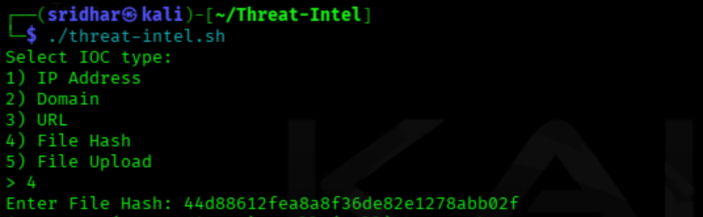
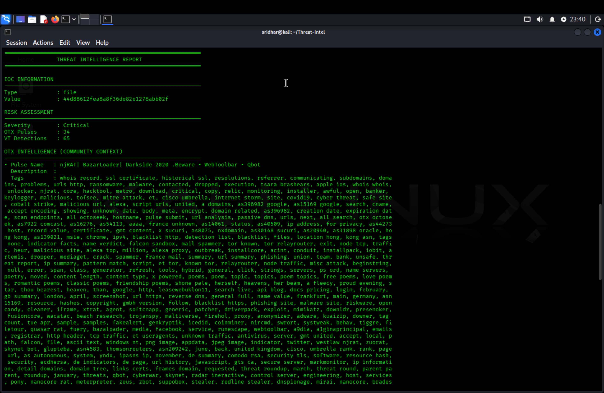
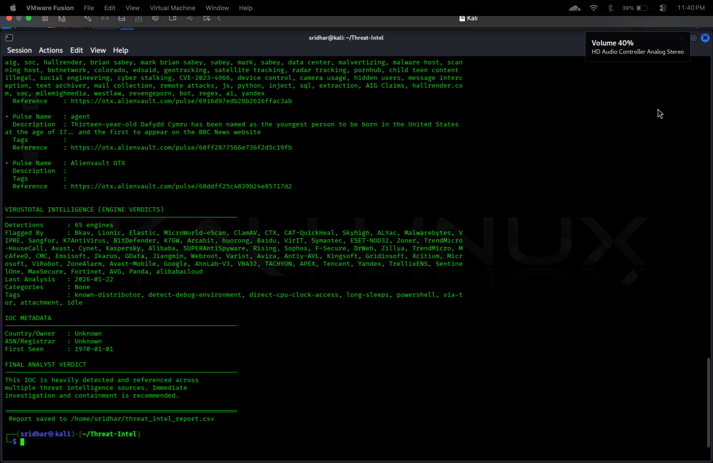

<!-- Horizontal Divider -->

# 🛡️ Threat-Intel

### IOC Enrichment & Risk Scoring using VirusTotal and AlienVault OTX

---

## 📌 Project Overview

**Threat-Intel** is a **Bash-based Threat Intelligence automation tool** designed for **SOC Analysts and Blue Team operations**.

It enriches **Indicators of Compromise (IOCs)** using **VirusTotal** and **AlienVault OTX**, calculates a **risk-based severity score**, and generates **structured analyst-ready reports** for investigation and documentation.

The tool supports:
- Real-time IOC enrichment  
- Automated severity calculation  
- Human-readable analyst reports  
- CSV-based historical tracking  

---

## 🎯 Objective

> **To automate IOC enrichment and threat context gathering using multiple intelligence sources and produce actionable SOC-ready outputs.**

---

## 🔍 Supported IOC Types

The tool supports the following IOC inputs:

- 🌐 IP Address  
- 🌍 Domain  
- 🔗 URL  
- 🧬 File Hash (SHA-256)  
- 📁 File Upload (hash calculated locally)  

---

## 🧠 Intelligence Sources Used

### 🔹 VirusTotal (API v3)
- Malware detection counts  
- Engine verdicts  
- Tags and categories  
- First-seen timestamps  

### 🔹 AlienVault OTX
- Community pulse references  
- Threat context and tags  
- Campaign-level intelligence  

---

## ⚙️ How the Tool Works (Workflow)

### 1️⃣ Environment Validation
- Verifies `.env` file presence  
- Validates API keys  

### 2️⃣ IOC Selection
- Analyst selects IOC type via interactive menu  
- Input validated and normalized  

### 3️⃣ Threat Intelligence Collection
- Queries VirusTotal and AlienVault OTX APIs  
- Extracts detection and contextual data  

### 4️⃣ Severity Scoring
Composite score calculated using:
- VirusTotal detections  
- OTX pulse references  

### 5️⃣ Analyst Report Generation
- Structured console report  
- CSV-based persistent storage  

---

## 📊 Severity Calculation Logic

| Score Range | Severity Level |
|------------|----------------|
| ≥ 15 | Critical |
| 8 – 14 | High |
| 4 – 7 | Medium |
| 1 – 3 | Low |
| 0 | Informational |

---

## 📄 Output Artifacts

### 🔹 Console Report
- Analyst-readable threat summary  
- IOC metadata  
- Detection context  
- Final verdict guidance  

### 🔹 CSV Report

**Location:**
bash
~/threat_intel_report.csv
Fields:
IOC Type
IOC Value
Severity
OTX Pulse Count
VirusTotal Detections
Flagging Vendors
Last Analysis Date
Country
Owner / ASN
First Seen

---

🖼️ Screenshots
▶️ IOC Selection & Execution

Shown
Interactive IOC menu
Analyst-driven input
File hash analysis example
📊 Threat Intelligence Report (Console Output)

Shown
Severity classification
VirusTotal detection engines
AlienVault OTX pulse context
## 📁 CSV Report Generation

Shown
Automatic CSV creation
Persistent IOC tracking
SOC documentation-ready output

---

## 🛠️ Prerequisites
Ensure the following tools are installed:
- bash
- curl
- jq
- base64
- shasum

---

## 🔐 API Configuration
Create a .env file in the project root:

VT_API_KEY=your_virustotal_api_key

OTX_API_KEY=your_alienvault_otx_api_key

⚠️ Do not commit .env to GitHub

(ensure it is listed in .gitignore).

---

## 🚀 How to Run

1️⃣ Make the script executable

chmod +x threat-intel.sh

2️⃣ Run the tool

./threat-intel.sh
